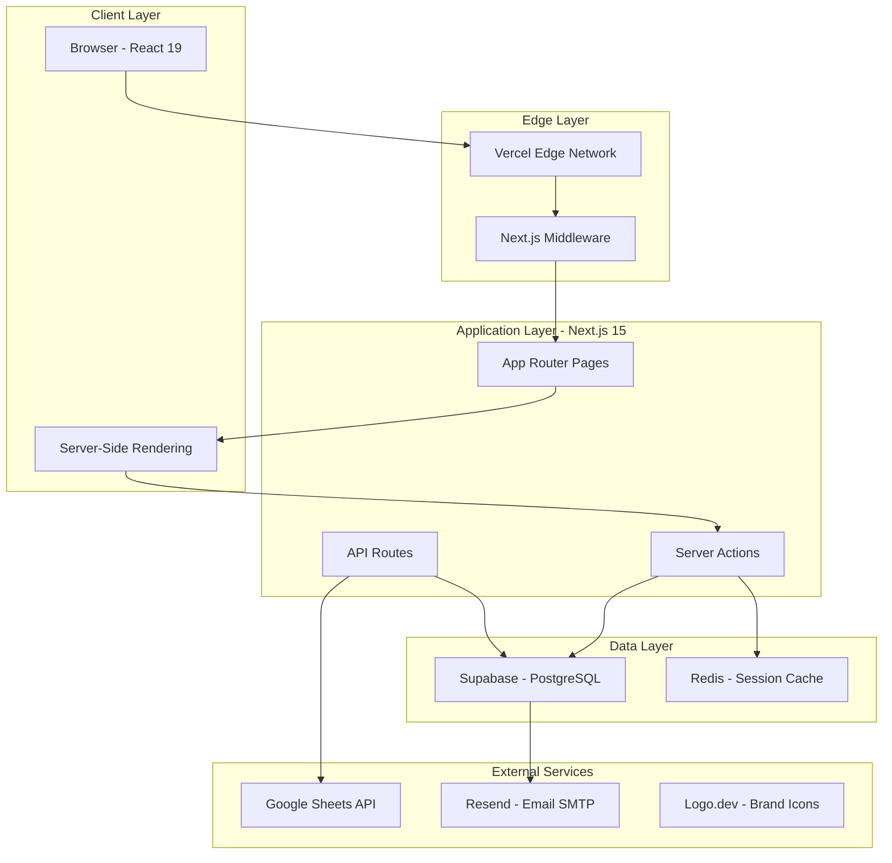
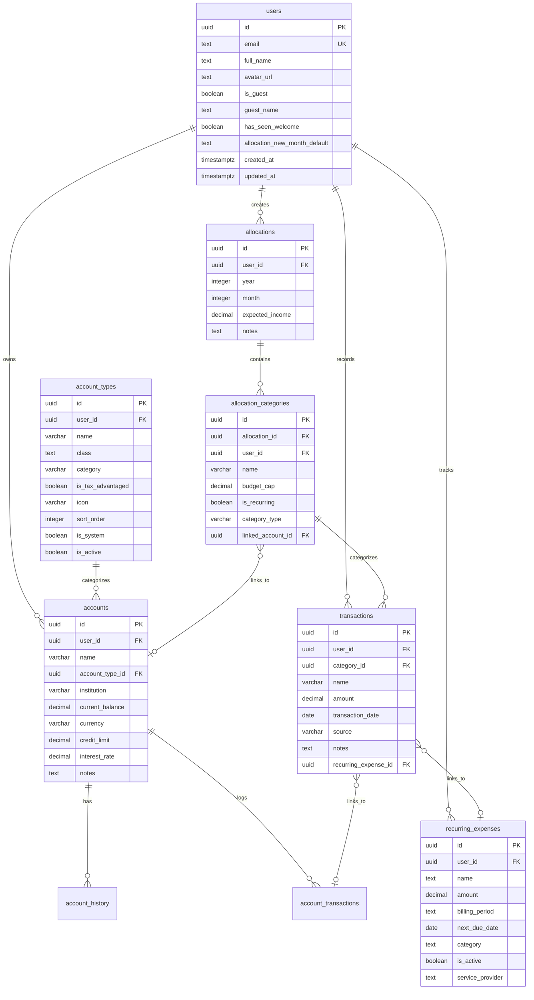
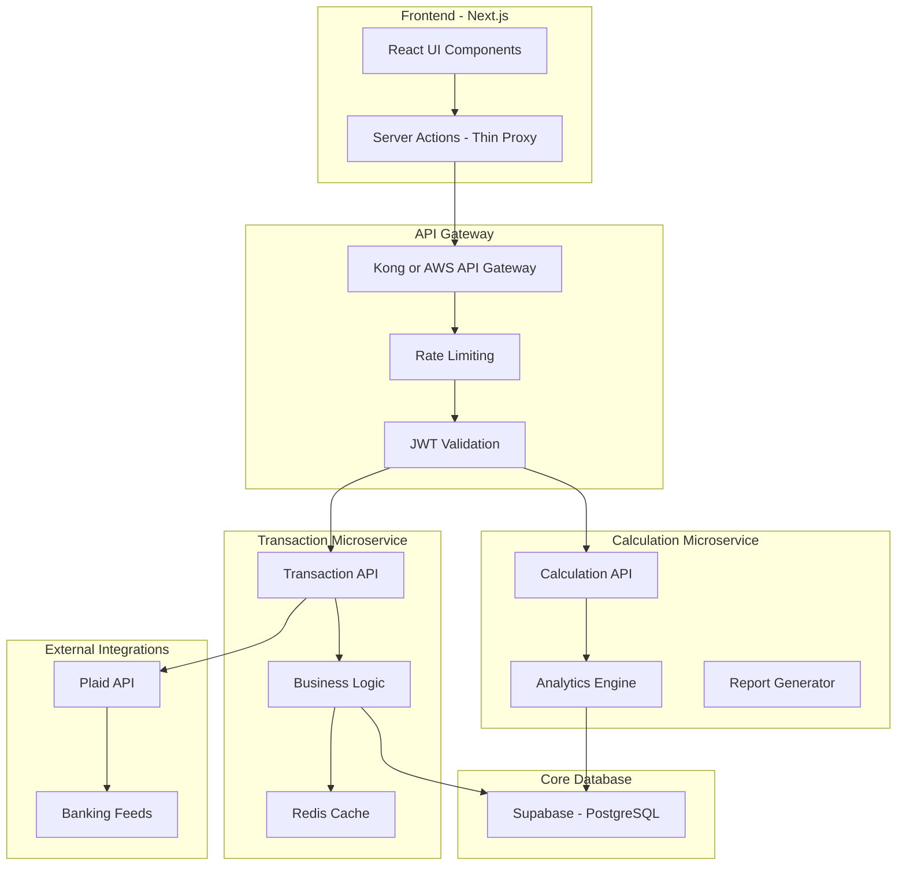
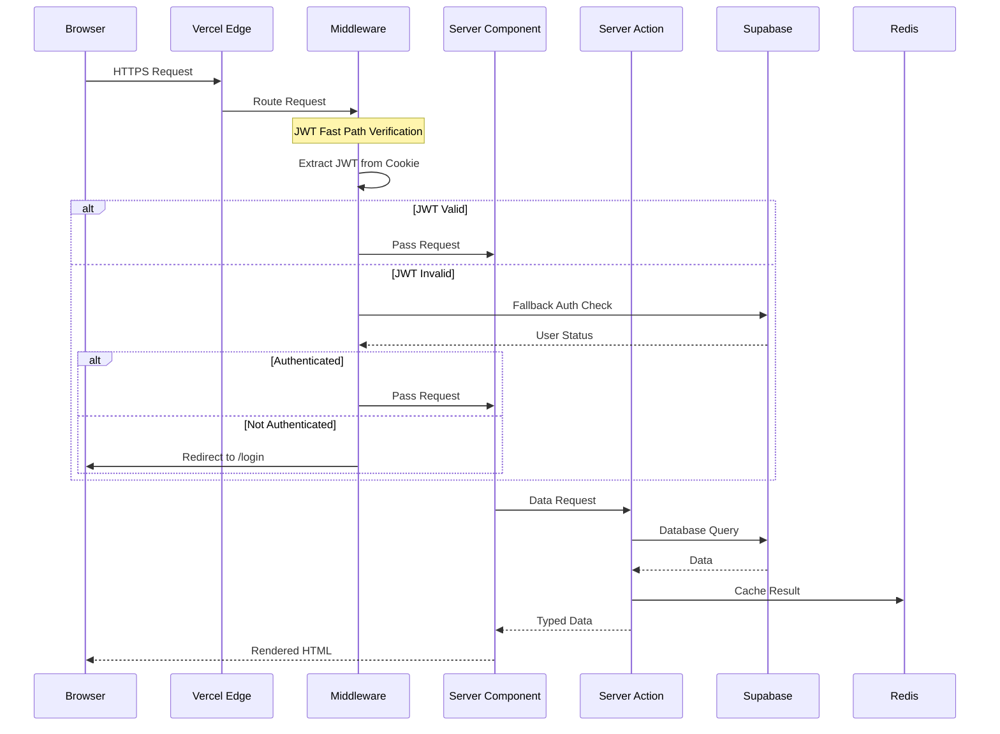
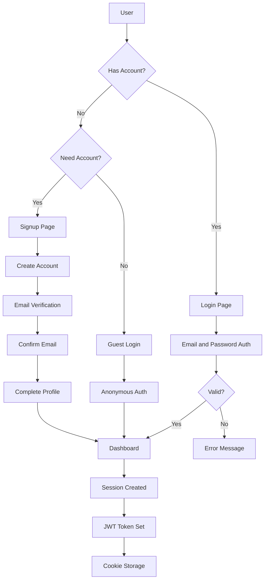
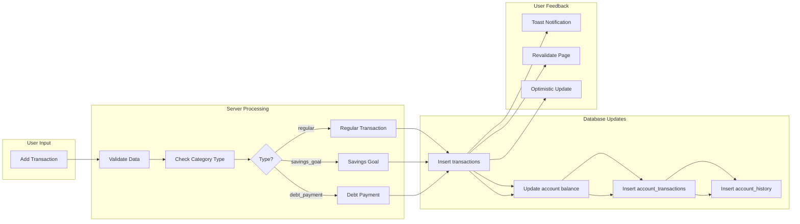
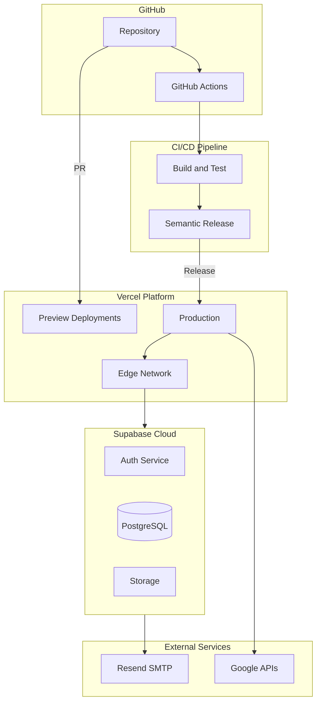

# Pholio - System Design and Architecture Blueprint

> **Version**: 1.2.2 | **Last Updated**: January 2026

---

## Table of Contents

1. [System Overview](#1-system-overview)
2. [Functional Requirements](#2-functional-requirements)
3. [Non-Functional Requirements](#3-non-functional-requirements)
4. [Technical Architecture](#4-technical-architecture)
5. [Database Architecture](#5-database-architecture)
6. [Data Flow](#6-data-flow)
7. [Security Design](#7-security-design)
8. [API Specifications](#8-api-specifications)
9. [Deployment Architecture](#9-deployment-architecture)
10. [Development Workflow](#10-development-workflow)
11. [Documentation](#11-documentation)
12. [Future Roadmap](#12-future-roadmap)

**Appendices**

- [Appendix A: Core Types](#appendix-a-core-types)
- [Appendix B: Environment Variables](#appendix-b-environment-variables)

---

## 1. System Overview

Pholio is a personal finance tracker and budgeting application designed for users who want **quick transaction entry**, **organized financial data**, and **all analytics in one place**—without relying on external tools like Google Sheets for analysis.

### What Makes Pholio Unique

| Pain Point                      | Pholio's Solution                                                                        |
| ------------------------------- | ---------------------------------------------------------------------------------------- |
| Slow transaction entry          | Streamlined forms with smart defaults and recurring templates                            |
| Scattered data across apps      | Unified dashboard combining budgets, accounts, bills, and analytics                      |
| Complex setups                  | Simple, organized interface—no learning curve                                            |
| Disconnected features           | Everything is interconnected: transactions auto-update budgets, accounts, and dashboards |
| Manual analysis in spreadsheets | Built-in analytics with cashflow trends, net worth tracking, and spending breakdowns     |

### Core Philosophy

- **Simple & Organized**: Clean interface without unnecessary complexity
- **Fast & Responsive**: Optimistic updates and minimal loading states
- **Interconnected Data**: All features share data—transactions update allocations, balances, and analytics automatically
- **Offline-First Design**: Sample data mode for development and demos without backend connectivity
- **Type Safety**: Full TypeScript with strict mode throughout the codebase
- **Security by Design**: Row Level Security (RLS) on all database tables
- **Modular UI Components**: Reusable component library for consistent experience

> 💡 **Future Architecture**: In a mature stage, we plan to extract transactions and calculations into a separate API service for better scalability and potential third-party integrations.

---

## 2. Functional Requirements

### Feature Overview

| Feature                 | Description                                                          | Status         |
| ----------------------- | -------------------------------------------------------------------- | -------------- |
| Budget Allocations      | Monthly budget planning with categorical spending caps and templates | ✅ Implemented |
| Balance Sheet           | Asset/liability tracking with net worth calculation                  | ✅ Implemented |
| Bills & Subscriptions   | Recurring expense tracking with payment status and due dates         | ✅ Implemented |
| Dashboard               | Financial overview with metrics, cashflow charts, and trends         | ✅ Implemented |
| Transactions            | Manual transaction entry with category linking                       | ✅ Implemented |
| Account Management      | Multi-account support with types, history, and interest tracking     | ✅ Implemented |
| User Authentication     | Email/password, guest mode, email verification                       | ✅ Implemented |
| Theme System            | Light/dark mode with system preference detection                     | ✅ Implemented |
| Export to Google Sheets | OAuth-based spreadsheet export                                       | ✅ Implemented |
| Social Finance          | Track money owed to/from friends and family                          | 📋 Planned     |
| Plaid Integration       | Automatic bank transaction import                                    | 📋 Planned     |
| AI Categorization       | Smart transaction categorization                                     | 📋 Planned     |

### Development Timeline

```
Phase 1 (Core):      Allocations → Balance Sheet
Phase 2 (Tracking):  Bills & Subscriptions → Recurring Expenses
Phase 3 (Analytics): Dashboard
Phase 4 (Future):    Social Finance → AI Features → Plaid Integration
```

### Detailed Feature Descriptions

#### Budget Allocations

- Monthly Planning: Create budget allocations for each month with expected income
- Categorical Spending: Define categories with budget caps (e.g., Groceries: $500/mo)
- Templates: Save and reuse budget templates across months
- Import Previous: Carry forward categories from the previous month
- Category Types: `regular`, `savings_goal` (linked to asset accounts), `debt_payment` (linked to liability accounts)
- Real-time Tracking: Utilization percentages update as transactions are added

#### Balance Sheet

- Account Types: System-defined and custom account types (checking, savings, credit card, mortgage, etc.)
- Asset/Liability Classification: Automatic grouping for net worth calculation
- Balance History: Track balance changes over time with automatic snapshots
- Interest Tracking: Support for simple/compound interest calculations
- Contribution Room: Optional tracking for tax-advantaged accounts (TFSA, RRSP, 401k)

#### Bills & Subscriptions

- Recurring Tracking: Track monthly, yearly, weekly, and biweekly expenses
- Service Recognition: Brand icons via Logo.dev API
- Payment Status: Automatic detection of `paid`, `partial`, `unpaid`, `overdue`, `upcoming`
- Transaction Linking: Manual or automatic matching with recorded transactions
- Due Date Notifications: Track upcoming payment dates

#### Dashboard

- Net Worth Widget: Total assets minus liabilities with trend indicator
- Cashflow Charts: Income vs expenses for month/quarter/year
- Spending Breakdown: Categorical expense visualization
- Recent Transactions: Quick access to latest financial activity
- Trend Data: Historical net worth tracking over 30 days

#### Social Finance (Planned)

- Casual Debt Tracking: Track who owes you and who you owe
- No Pressure Reminders: Gentle tracking without aggressive notification
- Settlement Tracking: Mark debts as partially or fully settled
- Split Bills: Divide expenses among friends/family

#### Plaid Integration (Planned)

- Bank Connection: Securely link checking, savings, and credit card accounts via Plaid
- Automatic Import: Pull transactions daily from connected institutions
- Transaction Matching: Auto-match imported transactions to budget categories
- Balance Sync: Keep account balances updated automatically
- Multi-Institution: Support for connecting multiple banks and credit unions

#### Statement Import (Planned)

- Bank Statement Upload: Import CSV/PDF bank statements for offline accounts
- Bill Statement Parsing: Extract amounts and due dates from utility/service bills
- OCR Processing: Parse scanned or photographed statements
- Manual Review: Queue imported transactions for user verification before posting
- Format Templates: Save import mappings for recurring statement formats

#### Email Notifications (Planned)

- Message Queue: BullMQ with Redis for reliable background job processing
- Bill Reminders: Configurable alerts before due dates (1 day, 3 days, 1 week)
- Budget Alerts: Notifications when spending approaches category limits
- Weekly Digest: Summary of financial activity and upcoming bills
- Retry Logic: Automatic retry with exponential backoff for failed deliveries
- Job Scheduling: Delayed and recurring jobs for digest emails and reminders

---

## 3. Non-Functional Requirements

| Requirement     | Target                       | Implementation Notes                      |
| --------------- | ---------------------------- | ----------------------------------------- |
| Availability    | 99.9% uptime                 | Vercel edge deployment with redundancy    |
| Performance     | <200ms for 95% requests      | Server-side rendering, JWT fast path      |
| Scalability     | 100,000 concurrent users     | Supabase connection pooling, edge caching |
| Security        | Industry-standard encryption | HTTPS, JWT, RLS, password hashing         |
| Privacy         | GDPR/CCPA compliant          | Data export, user deletion capabilities   |
| Reliability     | Data consistency             | PostgreSQL ACID, automatic triggers       |
| Maintainability | Well-documented              | TypeScript types, JSDoc, AGENTS.md        |
| Cross-platform  | Major browsers + mobile      | Responsive design (375px to 1440px+)      |
| Accessibility   | WCAG 2.1 AA                  | Color contrast 4.5:1 minimum              |
| Recovery        | 4-hour RTO                   | Supabase automatic backups                |

---

## 4. Technical Architecture

### High-Level Architecture

📷 INSERT IMAGE: diagram-1-high-level-architecture.png -->



### Technology Stack

| Layer      | Technology        | Version | Purpose                             |
| ---------- | ----------------- | ------- | ----------------------------------- |
| Runtime    | Bun               | Latest  | Package manager & runtime           |
| Framework  | Next.js           | 15.1.9  | Full-stack React framework          |
| UI Library | React             | 19.2.0  | Component-based UI                  |
| Language   | TypeScript        | 5.9.3   | Type-safe development               |
| Styling    | Tailwind CSS      | 3.4.17  | Utility-first CSS                   |
| Components | Radix UI / Shadcn | Various | Accessible UI primitives            |
| Charts     | Recharts          | 3.5.1   | Data visualization                  |
| State      | Zustand           | 5.0.8   | Client-side state management        |
| Rich Text  | TipTap            | 3.14.0  | Notes editor                        |
| Database   | PostgreSQL        | 17      | Primary data store (via Supabase)   |
| Auth       | Supabase Auth     | 2.86.2  | Authentication & session management |
| Caching    | Redis             | 7       | Session & data caching              |
| Logging    | Pino              | 10.1.0  | Structured logging                  |
| Email      | Resend            | -       | Transactional emails                |
| Deployment | Vercel            | -       | Edge deployment platform            |
| CI/CD      | GitHub Actions    | -       | Automated workflows                 |
| Versioning | Semantic Release  | 25.0.2  | Automated versioning                |

### Frontend Architecture

```
src/
├── app/                          # Next.js App Router
│   ├── (auth-pages)/             # Authentication flows
│   ├── allocations/              # Budget management
│   ├── balancesheet/             # Asset/liability tracking
│   ├── dashboard/                # Financial overview
│   ├── recurring/                # Bills & subscriptions
│   ├── settings/                 # User preferences
│   └── api/                      # API Routes
├── components/                   # Shared components
│   ├── ui/                       # Shadcn UI primitives (31 files)
│   ├── sidebar/                  # Navigation sidebar
│   └── dialogs/                  # Modal dialogs
├── hooks/                        # Custom React hooks
├── lib/                          # Utilities
│   ├── supabase/                 # Supabase clients
│   ├── auth.ts                   # Authentication helpers
│   └── database.types.ts         # Generated DB types
└── mock-data/                    # Sample data for dev mode
```

---

## 5. Database Architecture

### Entity Relationship Diagram

📷 INSERT IMAGE: diagram-2-entity-relationship.png -->



### Database Migrations

| Migration                     | Description                  |
| ----------------------------- | ---------------------------- |
| 001_core_identity.sql         | User management and triggers |
| 002_finance_accounts.sql      | Account structure            |
| 003_budgeting_allocations.sql | Budget system                |
| 004_finance_transactions.sql  | Transaction tracking         |
| 005_feature_recurring.sql     | Recurring bills              |
| 006_infra_storage.sql         | File storage policies        |

### Proposed Future Architecture (API Abstraction)

When we extract transactions and calculations into separate services:

📷 INSERT IMAGE: diagram-3-future-architecture.png -->



**Benefits:**

- Independent Scaling: Transaction-heavy operations can scale separately
- Third-Party Integration Ready: External apps can consume the same API
- Better Testing: Isolated services are easier to test
- Technology Flexibility: Services can use different tech stacks if needed

---

## 6. Data Flow

### Request Flow

📷 INSERT IMAGE: diagram-4-request-flow.png -->



### Authentication Flow

📷 INSERT IMAGE: diagram-5-authentication-flow.png -->



### Transaction Flow

📷 INSERT IMAGE: diagram-6-transaction-flow.png -->



---

## 7. Security Design

### Security Layers

| Layer            | Implementation      | Description                            |
| ---------------- | ------------------- | -------------------------------------- |
| Transport        | HTTPS/TLS           | All traffic encrypted via Vercel edge  |
| Authentication   | Supabase Auth + JWT | Token-based authentication             |
| Authorization    | Row Level Security  | Database-level access control          |
| Session          | HTTP-only Cookies   | Secure session storage                 |
| API Security     | JWT Validation      | Fast path + fallback verification      |
| Input Validation | TypeScript + Zod    | Type-safe input handling               |
| Rate Limiting    | Supabase Auth       | Built-in rate limits on auth endpoints |

### JWT Verification Strategy

The middleware uses a two-tier verification approach:

1. **Fast Path (1-2ms)**: Local JWT signature verification using cached JWKS
2. **Fallback (200-300ms)**: API call to Supabase if fast path fails
3. **Timeout Protection**: 3-second timeout to prevent hanging requests

### Row Level Security (RLS)

**Why RLS?**

- **Defense in Depth**: Even if application code has bugs, the database enforces access rules
- **Consistency**: Access rules defined once, enforced everywhere
- **Audit Compliance**: Clear, verifiable access policies at the data layer
- **Zero Trust**: Never trust the application layer alone with data access

---

## 8. API Specifications

### Current API Routes

| Endpoint                  | Method  | Description             | Auth Required |
| ------------------------- | ------- | ----------------------- | ------------- |
| /api/auth/users/[...path] | Various | User authentication     | No            |
| /api/google/export        | POST    | Export to Google Sheets | Yes + OAuth   |
| /api/logos/[domain]       | GET     | Fetch service logos     | Yes           |

### Proposed Future External API

| Endpoint                         | Method         | Description               |
| -------------------------------- | -------------- | ------------------------- |
| /api/v1/transactions             | GET/POST       | List/create transactions  |
| /api/v1/transactions/:id         | GET/PUT/DELETE | Single transaction ops    |
| /api/v1/accounts                 | GET            | List user accounts        |
| /api/v1/accounts/:id/balance     | GET            | Account balance history   |
| /api/v1/analytics/cashflow       | GET            | Cashflow data             |
| /api/v1/analytics/networth       | GET            | Net worth data            |
| /api/v1/allocations/:year/:month | GET            | Monthly allocation        |
| /api/v1/recurring                | GET            | Recurring expenses        |
| /api/v1/webhooks/plaid           | POST           | Plaid transaction updates |

### Server Actions Summary

**Allocations** (21 functions)

- Allocation CRUD, category management, transaction handling, template operations

**Balance Sheet** (18 functions)

- Account types, accounts CRUD, transactions, history, interest calculations

**Dashboard** (26 functions)

- Metrics, cashflow data, net worth, recent transactions

**Recurring** (9 functions)

- Recurring expense CRUD, status toggling

---

## 9. Deployment Architecture

### Infrastructure

📷 INSERT IMAGE: diagram-7-deployment-infrastructure.png -->



### Environment Configuration

| Environment | Purpose          | Trigger         |
| ----------- | ---------------- | --------------- |
| Development | Local testing    | `bun run dev`   |
| Preview     | PR review        | Automatic on PR |
| Production  | Live application | GitHub Release  |

---

## 10. Development Workflow

### Branch Strategy

- `main`: Production-ready code
- `development`: Integration branch for features
- `feature/*`: Individual feature branches
- `hotfix/*`: Emergency production fixes

### Commit Convention

| Type     | Version Impact | Example                     |
| -------- | -------------- | --------------------------- |
| feat     | Minor (x.Y.0)  | feat(auth): add guest login |
| fix      | Patch (x.y.Z)  | fix(ui): sidebar alignment  |
| perf     | Patch          | perf: optimize queries      |
| chore    | None           | chore: update deps          |
| docs     | None           | docs: update readme         |
| refactor | None           | refactor: cleanup logging   |

---

## 11. Documentation

| Document       | Location   | Purpose                     |
| -------------- | ---------- | --------------------------- |
| AGENTS.md      | Root       | AI coding guidelines        |
| README.md      | Root       | Project overview            |
| .agents/\*     | Agents dir | AI agent definitions        |
| .context/\*.md | Context    | Workflow & design standards |
| docs/\*.md     | Docs       | Feature specifications      |

---

## 12. Future Roadmap

### Planned Features

| Feature                | Priority | Complexity | Timeline |
| ---------------------- | -------- | ---------- | -------- |
| Social Finance         | High     | Medium     | Q1 2027  |
| Plaid API Integration  | High     | High       | Q2 2027  |
| Bank Statement Import  | High     | Medium     | Q2 2027  |
| AI Categorization      | Medium   | High       | Q3 2027  |
| Multi-currency Support | Medium   | Medium     | Q3 2027  |
| Investment Tracking    | Medium   | High       | Q4 2027  |
| Mobile App             | Low      | Very High  | 2028     |

### Technical Debt

- [ ] Add comprehensive test suite (Playwright + Vitest)
- [ ] Implement proper error boundaries
- [ ] Add OpenTelemetry instrumentation
- [ ] Migrate to Supabase Edge Functions for heavy compute
- [ ] Implement proper caching layer with Redis
- [ ] Extract transaction/calculation API service

---

## Appendix A: Core Types

```typescript
// Accounts
type AccountClass = "asset" | "liability";
type AccountCategory = "banking" | "investment" | "retirement" | "property" | "credit" | "debt" | "other";
type TransactionType = "deposit" | "withdrawal" | "interest" | "payment" | "adjustment" | "contribution" | "transfer";

// Allocations
type CategoryType = "regular" | "savings_goal" | "debt_payment";

// Recurring
type BillingPeriod = "monthly" | "yearly" | "weekly" | "biweekly";
type RecurringCategory = "subscription" | "bill";
type RecurringExpenseStatus = "paid" | "partial" | "unpaid" | "overpaid" | "upcoming" | "overdue";

// Dashboard
type Period = "month" | "quarter" | "year";
type TrendDirection = "up" | "down" | "neutral";
```

---

## Appendix B: Environment Variables

```
# Required
NEXT_PUBLIC_SUPABASE_URL
NEXT_PUBLIC_SUPABASE_PUBLISHABLE_KEY

# Optional - Production
RESEND_API_KEY
NEXT_PUBLIC_LOGO_DEV_TOKEN
LOGO_DEV_SECRET_KEY

# Local Development (Docker)
LOCAL_SUPABASE_URL
LOCAL_SUPABASE_PUBLISHABLE_KEY
LOCAL_SUPABASE_SERVICE_ROLE_KEY
```

> 💡 The `NEXT_PUBLIC_USE_SAMPLE_DATA` flag is set via the `dev:mock` script in `package.json` rather than in environment files.
